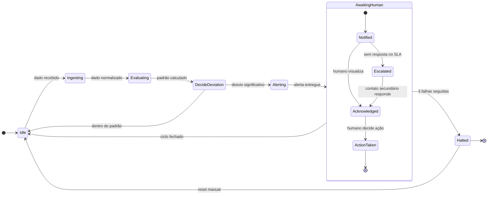

# Arquitetura — Loop de Vigilância (BazeX Care)

> Artefato vivo de arquitetura. O diagrama Mermaid abaixo renderiza direto no
> GitHub e é editável nó a nó — versionado junto do código.

O coração do BazeX Care é um **loop de vigilância** modelado como máquina de
estados formal: estados são substantivos (situações em que o sistema está),
transições são gatilhos (o que faz mudar de situação).

A regra inegociável que a arquitetura **prova**: o sistema nunca transiciona de
"detectei um desvio" direto para "tomei uma ação clínica". Sempre há um humano
no meio. É o mesmo princípio do fluxo `propõe → confirma → executa` da Giu
(tabela `pending_actions`) — aqui formalizado para o contexto clínico.

## Máquina de estados

## Os estados

| Estado | O que significa |
|--------|-----------------|
| `Idle` | Dormindo, aguardando dado novo (sinal vital, resposta do cuidador) |
| `Ingesting` | Recebeu o dado bruto e está normalizando |
| `Evaluating` | Comparando com o baseline (padrão normal) da pessoa |
| `DecideDeviation` | Ponto de decisão: o desvio é significativo? |
| `Alerting` | Desvio confirmado — disparando o alerta |
| **`AwaitingHuman`** | **Estado regulatoriamente crítico.** O sistema avisou e espera a decisão humana. NÃO age sozinho. |
| `Halted` | Circuit breaker: 3 falhas seguidas suspendem o loop. Só sai com reset manual. |

## As três peças que dão confiança

1. **`AwaitingHuman` (composite)** — encapsula `Notified → Acknowledged →
   ActionTaken`. Declara na própria arquitetura que existe um estado em que a
   máquina está esperando um humano e não faz nada por conta própria. Para um
   regulador (ANVISA, etc.), isso é o que torna a ferramenta confiável.

2. **Escalonamento** — `Notified → Escalated` quando ninguém responde dentro do
   SLA, acionando o contato secundário (família, outro cuidador). Sem isso, um
   alerta perdido vira ponto cego.

3. **`Halted` (circuit breaker)** — 3 falhas seguidas e o loop suspende em vez
   de insistir cegamente, impedindo o "loop infinito silencioso". Saída apenas
   por reset manual.
