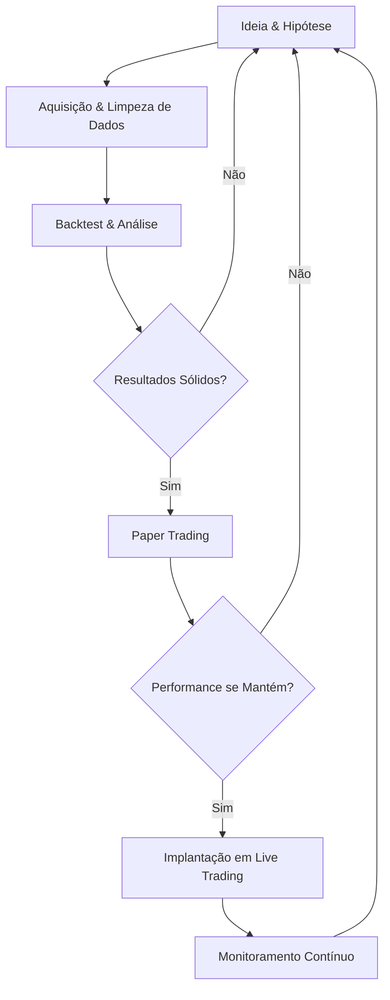

## 4. Desenvolvimento do Sistema: O "Ciclo de Vida" da Estratégia

O desenvolvimento de uma estratégia quantitativa é um processo iterativo e científico. Ele segue um ciclo de vida rigoroso, desde a concepção da ideia até a sua implementação e monitoramento contínuo. O objetivo é criar estratégias robustas que tenham uma alta probabilidade de sucesso no ambiente de mercado real.

### O Ciclo de Vida da Estratégia

O processo pode ser visualizado como um ciclo contínuo, onde cada etapa alimenta a próxima e os resultados são constantemente reavaliados.

Este ciclo garante que apenas as estratégias mais promissoras e bem validadas cheguem ao ambiente de produção, minimizando perdas e otimizando o desempenho.

### Backtesting: A Simulação Histórica

O backtesting é a etapa mais crítica do ciclo de vida. É aqui que a estratégia é simulada com dados históricos para avaliar sua performance teórica. Um backtest mal conduzido pode levar a conclusões enganosas e a perdas significativas no futuro.

#### Cuidados Cruciais no Backtesting

Para garantir a validade dos resultados, é essencial evitar vieses e armadilhas comuns. A tabela abaixo resume os principais pontos de atenção:

| Viés/Armadilha | Descrição | Como Evitar |
| :--- | :--- | :--- |
| **Overfitting (Sobreajuste)** | A estratégia se ajusta perfeitamente aos dados passados, mas falha em dados novos. É o maior inimigo do quant. | Utilizar técnicas como **walk-forward analysis** e validação cruzada no tempo. Manter a estratégia o mais simples possível. |
| **Viés de Sobrevivência** | Incluir no teste apenas ativos que "sobreviveram" até o final do período, ignorando os que faliram ou foram deslistados. | Utilizar bancos de dados que incluam o histórico de constituintes de índices e de ativos que deixaram de existir. |
| **Custos de Transação** | Ignorar os custos reais de operar no mercado, como corretagem, emolumentos, impostos e o spread bid-ask. | Incorporar uma estimativa realista dos custos em cada operação simulada. Estratégias que parecem lucrativas podem se tornar inviáveis após os custos. |
| **Slippage (Derrapagem)** | A diferença entre o preço esperado de uma ordem e o preço em que ela é realmente executada. | Simular o impacto das próprias ordens no mercado, especialmente para estratégias com alto volume ou em ativos de baixa liquidez. |

### Métricas de Performance

A avaliação de uma estratégia não deve se basear apenas no retorno total. Um conjunto de métricas de performance ajustadas ao risco fornece uma visão muito mais completa e realista do seu potencial.

| Métrica | Descrição | O que buscar |
| :--- | :--- | :--- |
| **Sharpe Ratio** | Mede o retorno ajustado ao risco. É a métrica mais importante para comparar estratégias. | Valores **> 1** são considerados bons, e **> 2** são excelentes. |
| **Maximum Drawdown (MDD)** | A maior perda percentual de um pico a um vale durante o período do backtest. | Um MDD baixo e dentro de um limite aceitável (ex: -15%). Indica a resiliência da estratégia. |
| **Volatilidade (Std Dev)** | Mede a dispersão dos retornos. Indica o "ruído" ou a instabilidade da estratégia. | Menor volatilidade para um mesmo nível de retorno é preferível. |
| **Beta** | Mede a sensibilidade da estratégia em relação aos movimentos do mercado (benchmark). | Um Beta baixo ou próximo de zero indica que a estratégia é descorrelacionada do mercado, o que é desejável para diversificação. |

